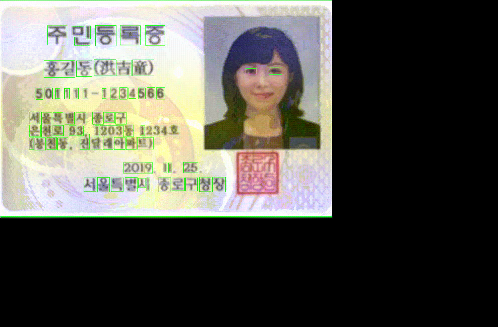
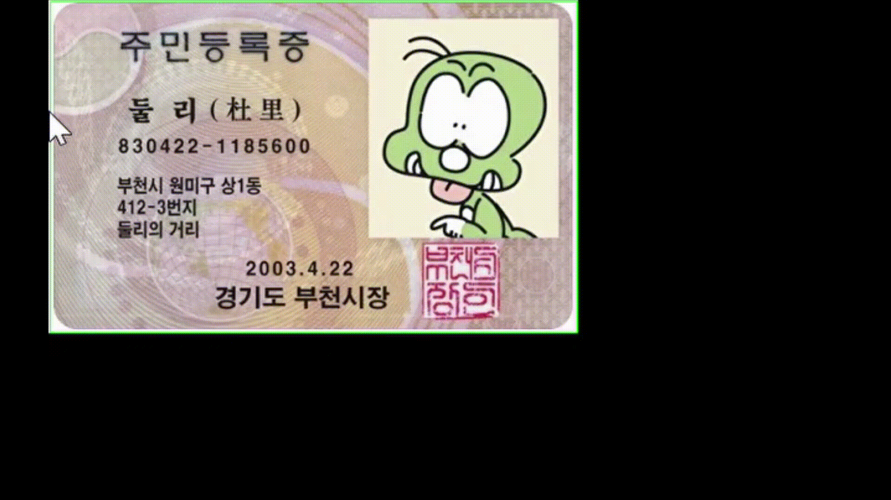

# ID_CARD

## **1. Production motivation**
 We approached it in a way that is the extraction of the area using a rectangle learned in class. First, we thought about what area to recognize as a rectangle and implemented text recognition by expanding what we have learned to recognize people or objects in the lecture. We thought about recognizing documents or cards, and through the process of sharing opinions, we decided to apply even a method of mosaic processing that protects personal information. Therefore, I tried to write a code that performs mosaic processing after scanning identification card as follows.  

---

## **2. Step of operation**
1. Download or copy [haarcascade_frontalface_default.xml](https://github.com/opencv/opencv/tree/master/data/haarcascades) for extraction text areas  
2. Upload ID card
3. Scan the ID card and extration text areas by rectangles. 
4. Designate an area  with mouse + push the "enter"  

---

## **3. Main code**   
* *extraction text area*  
* *extraction by squares*  
* *mosaic process by mouse dragging*   

---

## **4. Shortcomig**
Initially, we wanted to scan a identification card to extract a square and extract a mosaic by itself. Since it was not possible to implement a method of extracting a character area by specifying only specific texts, it was changed to a method of designating the desired area with the mouse and processing the mosaic.

---

## **5. Demonstration video**  
* Demonstration video of resident registration 1(Human version)

* Demonstration video of resident registration 2(Character version)

## **6. Reference Data**
* [Code for blurring a picture](https://scribblinganything.tistory.com/499)  
* [Code for extracting texts in images](https://webnautes.tistory.com/1449)    
* [ID card(person) images](https://www.mois.go.kr/frt/sub/a06/b06/IDCard/screen.do)  
* [ID card(dooly) images](https://zzznara.tistory.com/307)
